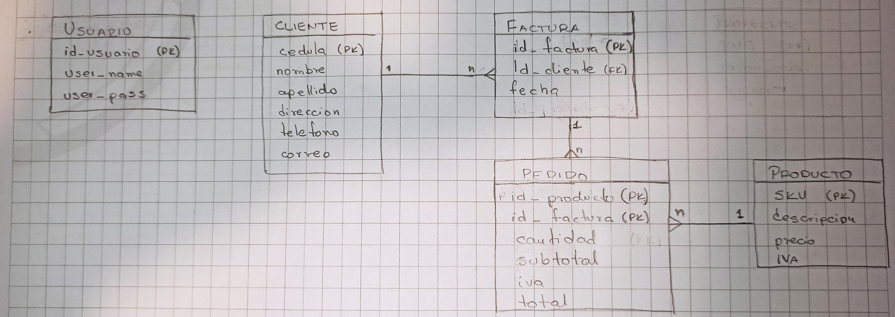

# Sistema de Facturacion
> Ing. Miguel Ángel Gaibor
 
Práctica QPH

BackEnd creado utilizando Maven, SpringBoot referente a un sistema de facturacion
Se han creado api REST para la creacion, consulta y edicion de Clientes, Productos, Facturas, Pedidos y Usuarios del sistema

También en la carpeta "resources" hay un archivo (FacturacionMG.postman_collection.json) que tiene las llamados desde Postman a las API

